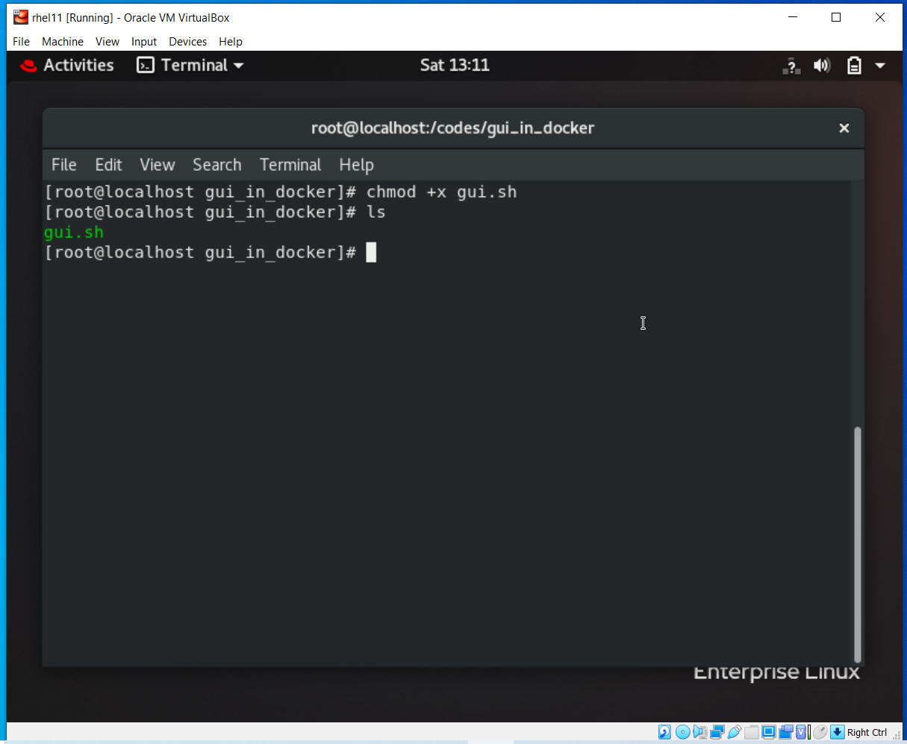
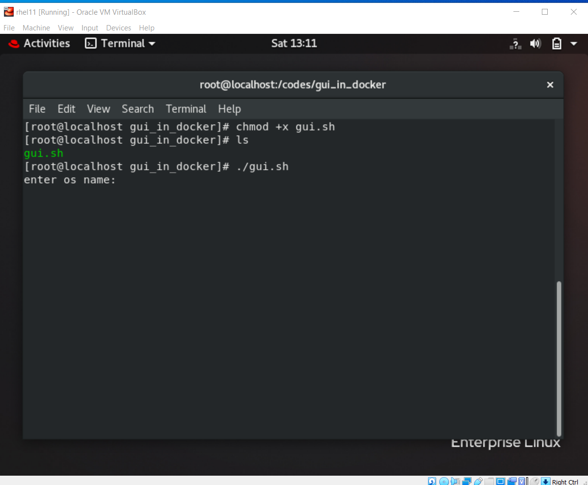
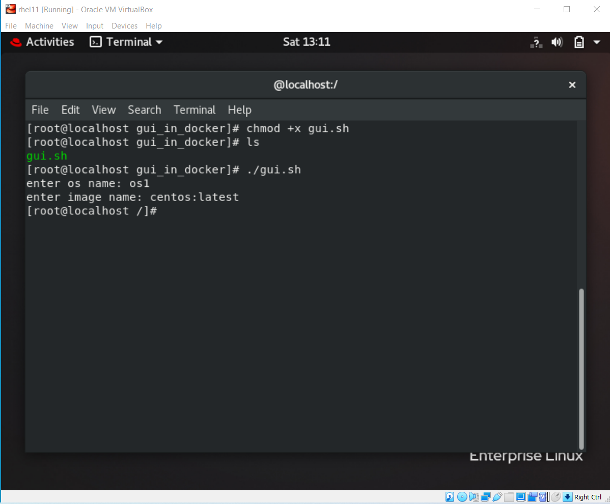
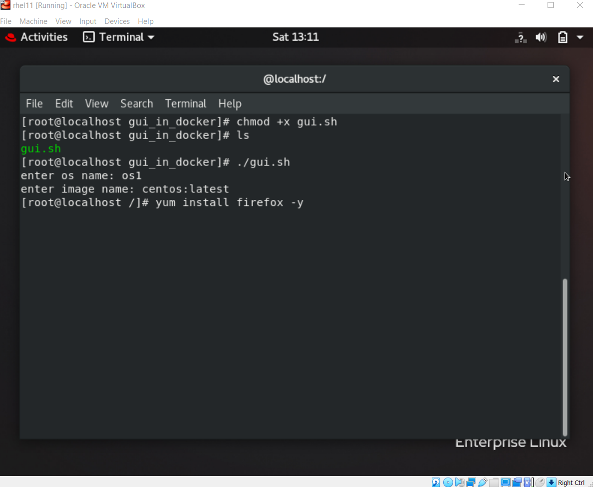
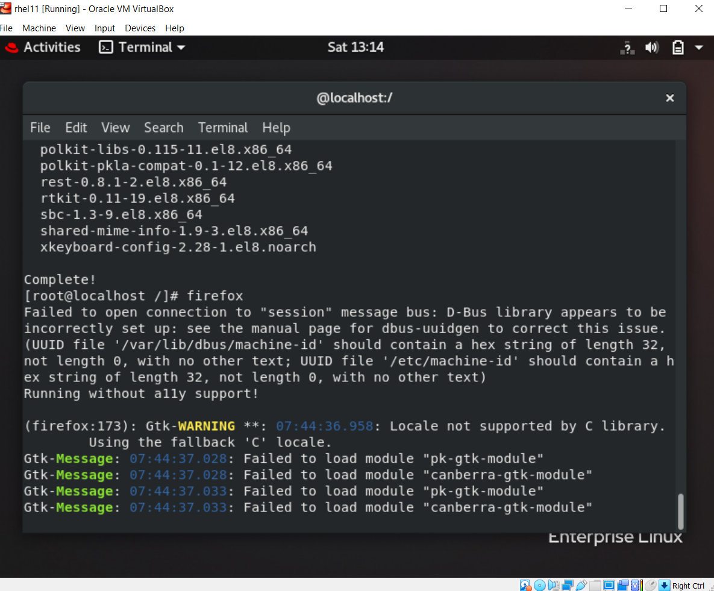

# GUI IN DOCKER

Running GUI Apps inside Docker Container
You only need to clone the repository and run the bash shell script

### Installation:
Clone the Repo
Install docker

### Run docker service (below comand is for redhat linux)

```
$ systemctl start docker
```

### Making Script runnable

```
$ chmod +x gui.sh
```

### Run the script

```
$ ./gui.sh
```

### enter os name

```
$ os1
```

### enter any image name 

```
$ centos:latest
```

### install any gui program

```
$ yum install firefox -y
```

### run gui program inside docker 

```
$ firefox
```

---
 
### Screenshots:

<p float="left">






</p>

---

### :heart: Found this project useful?

If you found this project useful, then please consider giving it a :star: on Github and sharing it with your friends via social media.

---

## Project Created & Maintained By

### Siddharth Chopra

<a href="https://twitter.com/sidd_art_"></a>
<a href="https://linkedin.com/in/siddharthchopra1/"></a>
<a href="https://instagram.com/siddharth_chopra"></a>


