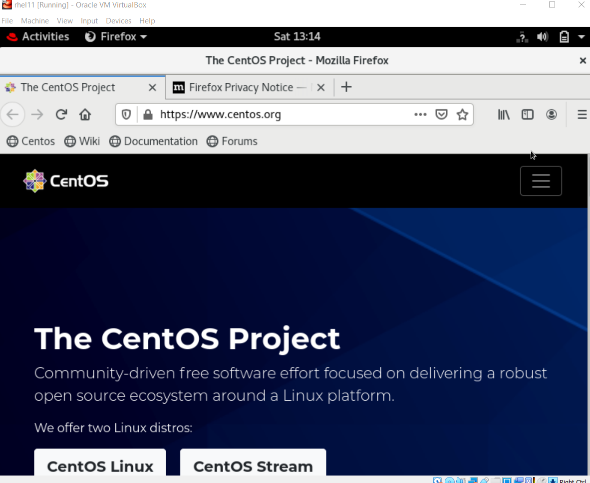

# GUI IN DOCKER

Running GUI Apps inside Docker Container
You only need to clone the repository and run the bash shell script

### Installation:
Clone the Repo
Install docker

### Run docker service (below comand is for redhat linux)

```
$ systemctl start docker
```

### Making Script runnable

```
$ chmod +x gui.sh
```

### Run the script

```
$ ./gui.sh
```

### enter os name

```
$ os1
```

### enter any image name 

```
$ centos:latest
```

### install any gui program

```
$ yum install firefox -y
```

### run gui program inside docker 

```
$ firefox
```

   
### Screenshots:

<p float="left">



</p>

